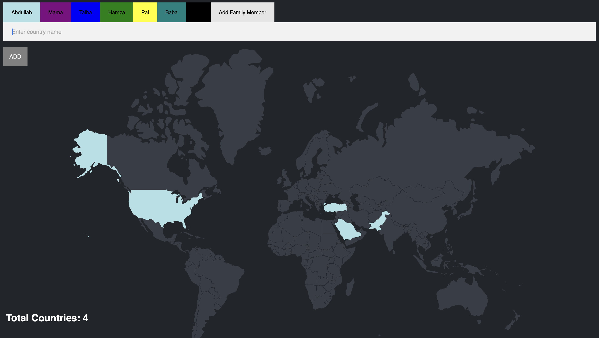

# Family Travel Tracker

**Travel Ticker** is a web application that lets you track the travels of your entire family. Users can add family members, log visited countries, and view dynamic maps showing travel history.

---

## Features

- Track travels for multiple family members
- Add new users with a preferred color
- Log visited countries for each member
- View visited countries on the homepage
- Highlight countries with color coding per user
- Prevent duplicate country entries
- Responsive UI with maps (future enhancement)

---

## Tech Stack

- **Backend:** Node.js, Express.js  
- **Frontend:** JavaScript, EJS, HTML, CSS  
- **Database:** PostgreSQL  
- **Other Packages:** body-parser, pg, fs  

---

## Installation
```bash
git clone https://github.com/abdullahali785/TravelTicker.git
cd TravelTicker

npm install

node index.js
```
- App runs at http:localhost:3000

---

## Abdullah's View


## Hamza's View 


## Add Family Member

